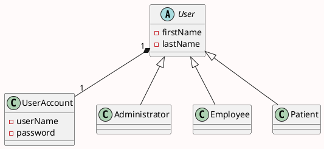

```plantuml
@startuml Account Management
    skinparam backgroundColor Snow

    User "1"*--"1" UserAccount

    abstract class User{
        -firstName
        -lastName
    }

    class Administrator extends User{

    }

    class Employee extends User{
        
    }
    class Patient extends User{

    }

    class UserAccount{
        -userName
        -password
    }
@enduml
```
